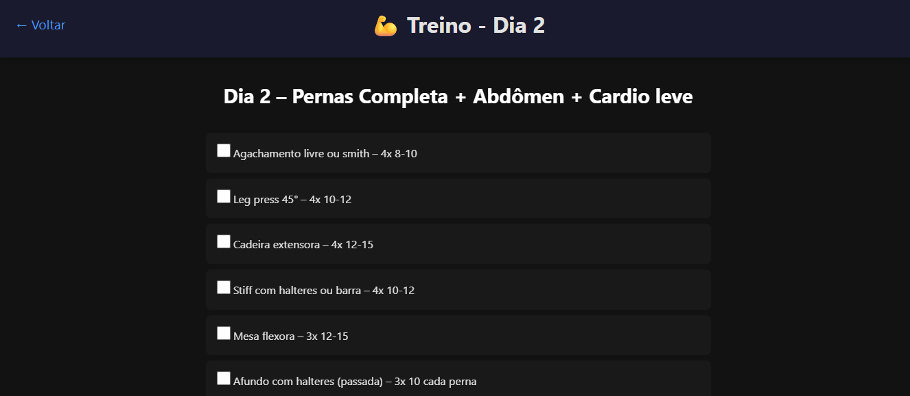
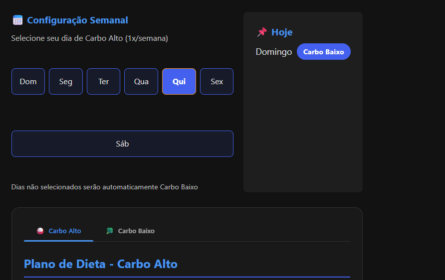

# 💪 Projeto Monstro - Sistema de Treinos e Dieta

Aplicação web completa para gerenciamento de rotinas de **treino** e **dieta**, com persistência de dados no navegador (LocalStorage). Simples, prática e eficiente.

  
  
---

## 🔥 Funcionalidades

### 🏋️‍♂️ Sistema de Treinos
- ✅ 5 dias de treino pré-configurados, com exercícios detalhados
- ✅ Controle de progresso com checkboxes persistentes
- ✅ Destaque automático do treino correspondente ao dia atual
- ✅ Navegação fluida e intuitiva entre os treinos

### 🥗 Gerenciamento de Dieta
- ✅ Definição personalizada do dia de **Carbo Alto**
- ✅ Sistema de abas para diferentes tipos de dieta
- ✅ Identificação visual do tipo de dieta vigente
- ✅ Dados da dieta salvos no navegador (persistência)

### 🔐 Autenticação Simples
- ✅ Login com persistência do nome de usuário
- ✅ Proteção de rotas (usuário não autenticado é redirecionado)

---

## 🛠️ Tecnologias Utilizadas
- ✔️ **HTML5 + CSS3** — Interface responsiva
- ✔️ **Vanilla JavaScript (JS puro)** — Sem dependências externas
- ✔️ **LocalStorage** — Persistência de dados no navegador

---

## 📁 Estrutura do Projeto
```plaintext
projeto-monstro/
├── index.html        → Página de login
├── menu.html         → Menu principal
├── workout.html      → Página de treino diário
├── diet.html         → Página de controle de dieta
├── script.js         → Lógica principal da aplicação
├── README.md         → Arquivo README
├── screenshots.png   → Imagens de demonstração rodando
└── styles.css        → Estilos e layout
```

---

## 🚀 Como Executar
1. Clone o repositório:
   ```bash
   git clone https://github.com/seu-usuario/projeto-monstro.git
   ```
2. Acesse a pasta do projeto:
   ```bash
   cd projeto-monstro
   ```
3. Execute abrindo o arquivo `index.html` no seu navegador.

4. Insira a senha, e comece a usar! Apenas para meu uso, ai por isso so a senha básica que coloquei libera o acesso, caso tenha interesse, basta alterar os arquivos e senhas correspondentes.

---

## 📌 Próximas Atualizações (TO-DO)
- ☁️ Sincronização com nuvem
- 🔐 Backend com banco de dados, onde cada senha libera um treino e dieta específicos
- ⏱️ Timer entre séries
- 📱 Otimização para dispositivos móveis

---

## 🤝 Contribuindo
1. Faça um **Fork** do projeto
2. Crie uma nova branch:
   ```bash
   git checkout -b feature/sua-feature
   ```
3. Commit suas alterações:
   ```bash
   git commit -m "Adiciona sua nova feature"
   ```
4. Envie para o seu fork:
   ```bash
   git push origin feature/sua-feature
   ```
5. Abra um **Pull Request** 🚀

---

## 👨‍💻 Desenvolvido por
**Gabriel Matheus** – [2025]  
Sinta-se à vontade para contribuir ou sugerir melhorias!
